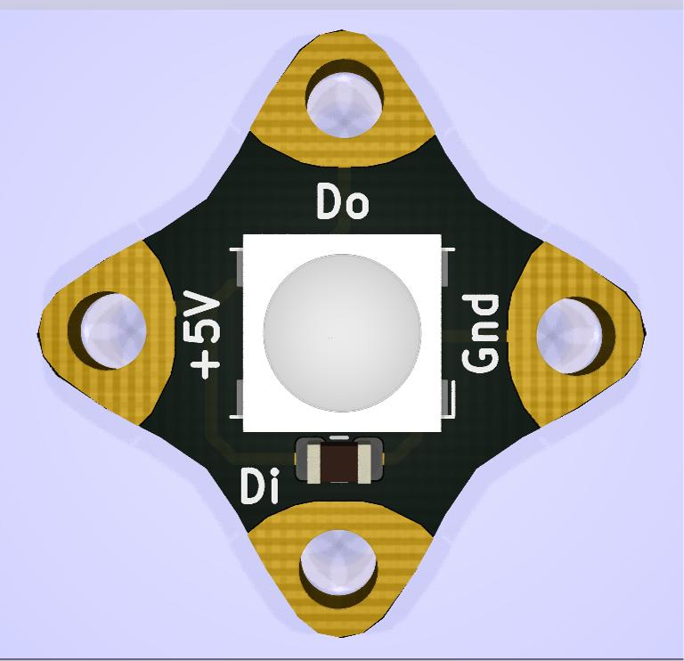
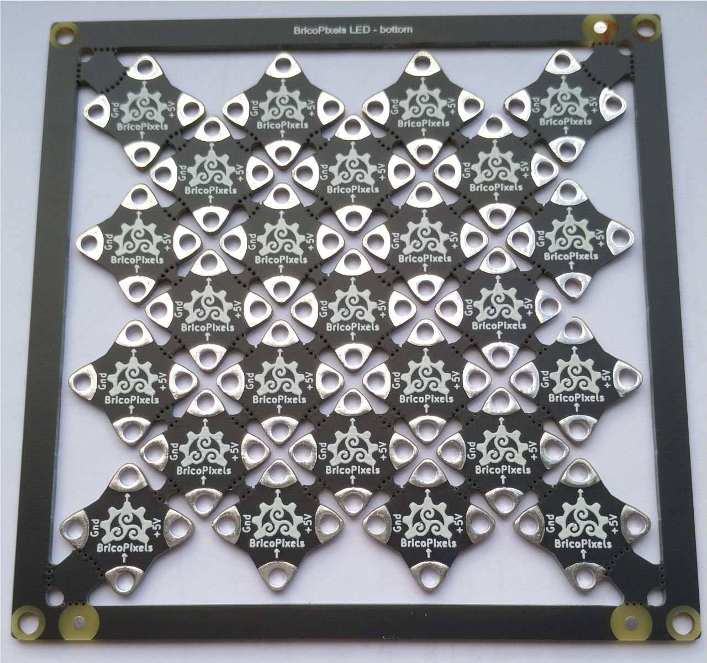

# BricoPixels LED

PCB diseñanda por BricoLabs para utilizar en proyectos de e-textile. Se utiliza un LED RGB [WS2812B](assets/WS2812B.pdf) el cual incorpora un circuito de control dentro del propio componente, que es un encapsulado 5050.

Para utilizar junto con microcontroladores AVR de Atmel (ATmega, ATtiny) o con la familia ESP de Espressif (ESP8266, etc) 

Cada BricoPixel lleva tan solo dos componentes:

* LED RGB [WS2812B](https://www.tme.eu/es/details/ws2812b-b/leds-smd-de-colores/worldsemi/ws2812b-black/) con encapsulado de color negro.
* Condensador [SMD de 100nF 0805](https://www.tme.eu/es/details/08051c104kat2a/condensadores-mlcc-smd-0805/avx/), para estabilizar la tensión de alimentación del circuito de control del LED RGB.

La forma de la placa PCB está diseñada para poder coserla directamente sobre cualquier textil con hilo conductor, o incluso pegarla sobre otras superficies planas.

En el directorio *gerber* se encuentra la PCB ya panelizada y lista para fabricar, en placas de 10 x 10 cm y con 25 unidades de BricoPixel cada una. Para esto se utilizó el software [GerberTools](https://github.com/ThisIsNotRocketScience/GerberTools).

**Se recomienda un grosor de PCB menor o igual a 1 milímetro.** Esto facilita recortar manualmente cada uno de los BricoPixel.

----

Esta obra está bajo una [licencia de Creative Commons Reconocimiento 4.0 Internacional (CC-BY)](http://creativecommons.org/licenses/by/4.0/).

